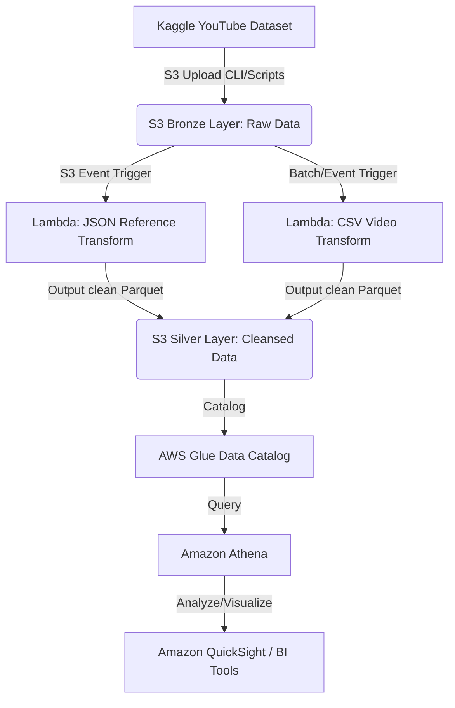

# 📊 YouTube AWS Data Engineering Pipeline (2026)

An end-to-end, serverless AWS Data Engineering pipeline designed to ingest, cleanse, transform, and analyze the YouTube Trending Dataset. 

This pipeline takes raw data (in JSON and CSV formats) landing in an S3 Bronze layer, transforms it into clean, compressed columnar **Parquet** format using AWS Lambda (leveraging `pandas` and `awswrangler`), indexes it via the AWS Glue Data Catalog, and enables fast querying using Amazon Athena.

---

## 🏗️ Architecture & Data Flow



1. **Bronze Layer (Raw)**: Ingests raw CSV statistics files and JSON category reference files partitioned by `region`.
2. **Lambda Cleanse & Transform**:
   - `lambda/json_to_parquet/lamda_function.py`: Triggered by S3 landing of JSON reference data. Normalizes, validates, removes duplicates, appends metadata (ingestion timestamp, source filename), and saves it back partitioned by `region` as Parquet.
   - `scripts/lambda_convert_to_parquet.py`: Batches raw CSV statistics, parses with pandas, converts to columnar Parquet via PyArrow, and writes back.
3. **Silver Layer (Cleaned & Columnar)**: Standardized Parquet format stored in S3, optimizing storage space (up to 90% savings) and query speeds.
4. **AWS Glue & Athena**: Catalogs schemas and partitions automatically, allowing seamless SQL querying via Athena.

---

## 📁 Repository Structure

```tree
youtube-aws-pipeline-2026/
├── .gitignore               # Configured to exclude heavy raw data (.csv, .json) & envs
├── README.md                # Project documentation
├── lambda/
│   └── json_to_parquet/
│       └── lamda_function.py # Clean & validation lambda code for reference JSONs
└── scripts/
    ├── aws_copy.sh          # S3 helper CLI copy commands
    ├── information.md       # Target AWS Buckets & Glue configurations
    ├── lambda_convert_to_parquet.py # PyArrow-based CSV to Parquet converter
    └── requirements-lambda.txt # Lambda Python dependency requirements
```

---

## 🛠️ Local Development & Deployment

### Dependencies
Dependencies are listed in `scripts/requirements-lambda.txt`:
```txt
pandas
pyarrow
awswrangler
boto3
```

### AWS Lambda Deployment Tips:
* **Lambda Layer**: Since `pandas` and `awswrangler` are large, build an AWS Lambda Layer with these dependencies or use a container image.
* **Environment Variables**:
  * `S3_BUCKET_SILVER`: Target S3 silver layer bucket name.
  * `GLUE_DB_SILVER` (Optional): Glue database name.
  * `GLUE_TABLE_REFERENCE` (Optional): Glue table name.
  * `SNS_ALERT_TOPIC_ARN` (Optional): SNS ARN for error notifications.

---

## 🐙 Git & GitHub Integration

This repository is fully configured with a `.gitignore` that safely excludes all local raw data (`data/` directory and large `.csv` files) to keep the repository lean and prevent GitHub upload errors (since GitHub has a strict **100MB** file limit).

### How to use Git with this project:
Refer to the instructions in the terminal/chat on how to create your GitHub repository, connect your local repository, and push code changes.
